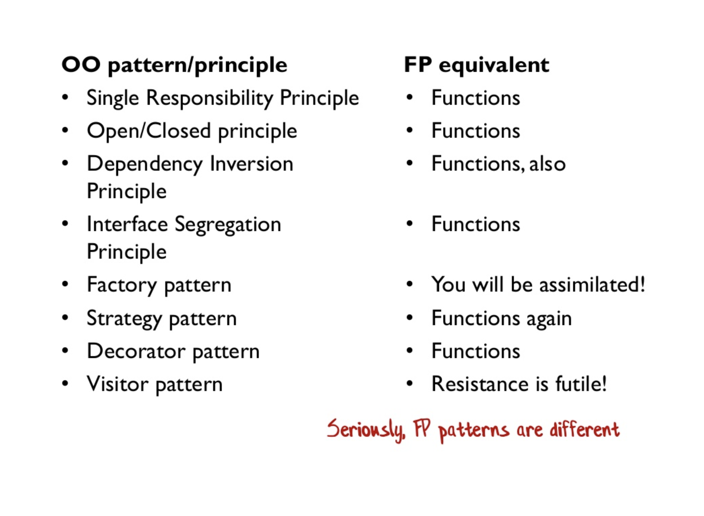

---

theme : "night"
transition: "slide"
highlightTheme: "monokai"
slideNumber: true
title: "SAFE Stack"

---

### Functional Programing with F #

<style>
pre {
  background: #303030;
  padding: 10px 16px;
  border-radius: 0.3em;
  counter-reset: line;
}
pre code[class*="="] .line {
  display: block;
  line-height: 1.8rem;
  font-size: 1em;
}
pre code[class*="="] .line:before {
  counter-increment: line;
  content: counter(line);
  display: inline-block;
  border-right: 3px solid #6ce26c !important;
  padding: 0 .5em;
  margin-right: .5em;
  color: #afafaf !important;
  width: 24px;
  text-align: right;
}

.reveal .slides > section > section {
  text-align: center;
}

h1,h2,h3,h4 {
  text-align: center;
}

p {
  text-align: center;
}
</style>

---

### What is Functional programming ? 🤔

--

A programming paradigm where programs are constructed by applying and composing functions. It is a declarative programming paradigm in which function definitions are trees of expressions that each return a value, rather than a sequence of imperative statements which change the state of the program. - wiki

--


<https://ithelp.ithome.com.tw/articles/10233761>

---

### Design Pattern/principle



---

### Curry

```
let add42 = (+) 42 // partial application
add42 1
add42 3

// create a new list by applying the add42 function
// to each element
[ 1; 2; 3 ] |> List.map add42

let printer = printfn "printing param=%i"
[ 1; 2; 3 ] |> List.iter printer
```


---

### References

---

## [return to Outline](../../export/index.html#/2)
