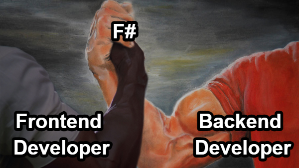
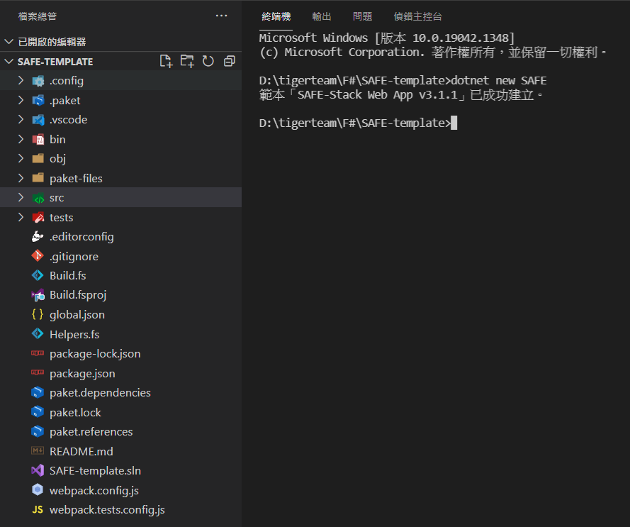
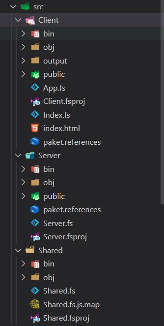
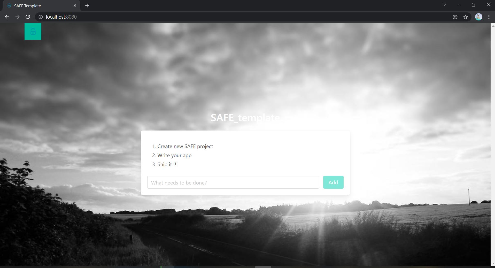

---

theme : "night"
transition: "slide"
highlightTheme: "monokai"
slideNumber: true
title: "SAFE Stack"

---

### ch 3

### SAFE Introduciton

---

### SAFE Stack😎

<https://safe-stack.github.io/>

--

#### Why SAFE Stack?

--

#### SAFE

- **S**aturn
  - Lightweight and simple server-side programming
- **A**zure
  - For Hosting and Services
- **F**able
  - F# in the Browser
- **E**lmish
  - For simple to understand web app development

--

#### Install pre-requisites

- [.NET 5 SDK](https://dotnet.microsoft.com/download/dotnet/5.0)
- [node.js](https://nodejs.org/) (>= 8.0)
- [npm](https://www.npmjs.com/)

---

### SAFE template

#### Create your first SAFE app

--

### Install SAFE template

1. Open a command prompt
1. Create a new directory on your machine and navigate into it
1. Enter `dotnet new -i SAFE.Template` to install the [SAFE project template](https://safe-stack.github.io/docs/template-overview/) (only required once)

--

### Run the App

1. Enter `dotnet new SAFE` to create a new SAFE project
1. Enter `dotnet tool restore` to install local tools like Fable.
1. Enter `dotnet run` to build and run the app
1. Open a web browser and navigate to <http://localhost:8080>.

---

#### Template Structure

--

#### ./src/

--

#### App

---

### References

<https://www.compositional-it.com/consultancy/safe-stack/>
<https://safe-stack.github.io/docs/quickstart/>

---

## [return to Outline](../../export/#/2)
