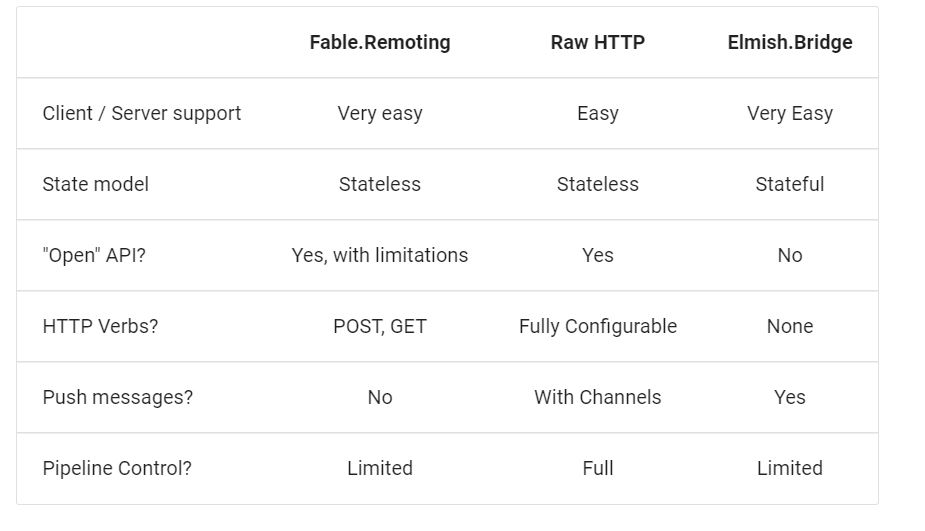

---

theme : "night"
transition: "slide"
highlightTheme: "monokai"
slideNumber: true
title: "SAFE Stack"

---

### ch 6

### SAFE Template Overview

<style>
pre {
  background: #303030;
  padding: 10px 16px;
  border-radius: 0.3em;
  counter-reset: line;
}
pre code[class*="="] .line {
  display: block;
  line-height: 1.8rem;
  font-size: 1em;
}
pre code[class*="="] .line:before {
  counter-increment: line;
  content: counter(line);
  display: inline-block;
  border-right: 3px solid #6ce26c !important;
  padding: 0 .5em;
  margin-right: .5em;
  color: #afafaf !important;
  width: 24px;
  text-align: right;
}

.reveal .slides > section > section {
  text-align: center;
}

h1,h2,h3,h4 {
  text-align: center;
}

p {
  text-align: center;
}
</style>

---

### Client/Server messaging

#### 1. Fable.Remoting

#### 2. Raw HTTP



---

### [Fable.Remoting](https://zaid-ajaj.github.io/Fable.Remoting/)

--

### Shared

```fsharp=
module Route =
    let builder typeName methodName =
        sprintf "/api/%s/%s" typeName methodName

type ITodosApi =
    { getTodos: unit -> Async<Todo list>
      addTodo: Todo -> Async<Todo> }
```

### Sever

```fsharp=
let todosApi =
    { getTodos = fun () -> async { return storage.GetTodos() }
      addTodo =
          fun todo ->
              async {
                  match storage.AddTodo todo with
                  | Ok () -> return todo
                  | Error e -> return failwith e
              } }

let webApp =
    Remoting.createApi ()
    |> Remoting.withRouteBuilder Route.builder
    |> Remoting.fromValue todosApi
    |> Remoting.buildHttpHandler

//http:localhost:8085/api/ITodosApi/getTodos
//http:localhost:8085/api/ITodosApi/addTodo
```

--

### Client

```fsharp=
let todosApi =
    Remoting.createApi ()
    |> Remoting.withRouteBuilder Route.builder
    |> Remoting.buildProxy<ITodosApi>
```

---

### [MongoDB F#](https://medium.com/@mukund.sharma92/cruding-in-f-with-mongodb-e4699d1ac17e)

---

### [Serilog](https://github.com/Zaid-Ajaj/Giraffe.SerilogExtensions)

---

### References

<https://safe-stack.github.io/docs/recipes/client-server/messaging/>
<https://safe-stack.github.io/docs/recipes/client-server/messaging-post/>

---

## [return to Outline](../../export/#/2)
