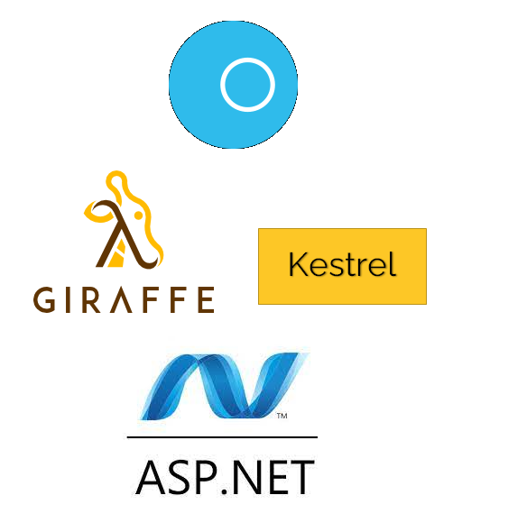

---

theme : "night"
transition: "slide"
highlightTheme: "monokai"
slideNumber: true
title: "SAFE Stack"

---

### ch 4

### Saturn

<style>
pre {
  background: #303030;
  padding: 10px 16px;
  border-radius: 0.3em;
  counter-reset: line;
}
pre code[class*="="] .line {
  display: block;
  line-height: 1.8rem;
  font-size: 1em;
}
pre code[class*="="] .line:before {
  counter-increment: line;
  content: counter(line);
  display: inline-block;
  border-right: 3px solid #6ce26c !important;
  padding: 0 .5em;
  margin-right: .5em;
  color: #afafaf !important;
  width: 24px;
  text-align: right;
}

.reveal .slides > section > section {
  text-align: center;
}

h1,h2,h3,h4 {
  text-align: center;
}

p {
  text-align: center;
}
</style>

---

### What is Saturn ?

Saturn is a web development framework written in F# which implements the server-side MVC pattern.

<https://saturnframework.org/explanations/overview.html>
<https://saturnframework.org/>

--

### Why Saturn? 🧐

- SAFE official recommend 👍
- Modern programming model 👍
- High performance 👍
- Developer experience 👍
- Created by Community 👍

note:
SAFE官方推薦
Saturn 將眾所周知的 MVC 模式與 FP 和 F# 的強大功能相結合，使 Web programing變得有趣而簡單

---

### Saturn Architecture



note:saturn建立於Asp.net之上，他提供了builder來簡化配置Web app的過程。而Saturn也提供了許多與Giraffe一起使用的功能，Giraffe的作用是什麼呢? 他的主要目的就是在asp.net上使用functional programing的方式建立web app. 而Kestrel則是適用于 ASP.NET Core的跨平臺 web 伺服器，目的是用來創立高性能的Web伺服器，而Saturn也可以在上面運行。

---

### Saturn Introduction

--

### Hello world Saturn

```Fsharp=
open Saturn
open Giraffe

let endpoints =
    router { get "/" (text "Hello World from Saturn") }

let app =
    application {
        url ("https://localhost:5000")
        use_router endpoints
    }

run app
```

--

### Practice

1. Create F# console project
   -  `dotnet new console -lang "F#"`
2. Add the Saturn NuGet Package 
   - `dotnet add package Saturn`

--

3. Copy and paste

```Fsharp=
open Saturn
open Giraffe

let endpoints =
    router { get "/" (text "Hello World from Saturn") }
  //Change the text function in endpoints to either xml or json.
let app =
    application {
        url ("https://localhost:5000")
        use_router endpoints
    }

run app
```

---

### Config of Saturn

```Fsharp=
let app =
    application {
        url ("https://localhost:5000")
        use_router endpoints
        memory_cache
        use_static "public"
        use_gzip
    }
```

<https://github.com/SaturnFramework/Saturn/blob/master/src/Saturn/Application.fs>
<https://docs.microsoft.com/en-us/aspnet/core/performance/caching/memory?view=aspnetcore-6.0>

---

### Saturn Router

```FSharp=
let getProductById (productId: int64) =
    let a = (sprintf "Hello my id is %d" productId)
    text a

let routes =
    router {
        get "/" (text "Hello from Saturn!")
        getf "/%d" getProductById
        //post、delete、put、postf...
    }
```

note:這邊提供許多路由的方式。

--

### forward

```FSharp=
let publicApi =
    router { get "/" (text "This is publicApi") }

let routes = router { forward "/public" publicApi }
```

note:會在下一個function前面加上你想加的前綴url

---

### Saturn Controller

--

### Resource

- Path to a function
    - Use router `{ }`
    - Links a function to an endpoint
- Path to an object
    - Use controller `{ }`
    - Provides a set of ready-made endpoints for CRUD behaviour over an object.

--

### controller

```Fsharp=
let resource = controller {
    index indexAction
    show showAction
    add addAction
    edit editAction
    create createAction
    update updateAction
    patch patchAction
    delete deleteAction
    deleteAll deleteAllAction
}
```

--

-   `index` — mapped into `GET` request at `/` endpoint. Usually used to render a view displaying list of items, or return whole list of items.
-   `show` — mapped into `GET` request at `/:id` endpoint. Usually used to render a view displaying details of particular item, or return single item with given id.
-   `create` — mapped into `POST` request at `/` endpoint. Used to create and save new item.

--

-   `update` — mapped into `POST` and `PUT` requests at `/:id` endpoint. Used to update existing item. Usually replaces original item (keeping id), and requires are fields to be filled in the incoming item.
-   `delete` — mapped into `DELETE` request at `/:id` endpoint. Used to delete or deactivate existing item.
-   `deleteAll` — mapped into `DELETE` request at `/` endpoint. Used to delete or deactivate all items.

<https://medium.com/lambda-factory/magic-of-saturn-controllers-bafbc46d485f>

--

#### example
```Fsharp=
let helloEndpoint = controller{
    index (fun ctx -> "Hello" |> Controller.text ctx)
    show (fun ctx id -> (sprintf "Show %i" id)|> Controller.text ctx)
}
```

---

### Saturn Fundamentals

--

### HTTP Context (ctx)

- Contains all details on the request / response
  - URL
  - Query String
  - Headers
  - Body

--

### HTTP Endpoints as Functions

- Http Request ⏩ Http Response
- HttpContext ⏩ HttpContext

--

### HTTP Handler

#### For example: text

- Sets the Content Type to text/plain
- Sets the Response Body to the text you provide it
- Sets the Response Code to 202

--

### HTTP handler can be composed

--

### Code snipts

```Fsharp=
module Fuber.Routes

open Giraffe
open Saturn


type Profile = { Username: string }

let getProfile next ctx =
    let profile = { Username = "JW" }

    json profile next ctx
// next ctx //return this , pipeline will return getProfile2 result

// never run
let getProfile2 next ctx =
    let profile = { Username = "QQ" }

    json profile next ctx

let setMyHeader = setHttpHeader "myCustomHeader" "abcd"


let headerPipe =
    pipeline {
        plug setMyHeader
        plug getProfile
        plug getProfile2 // never run because getProfile get something, if getProfile return None, pipeline will continue.
    }

let apiRouter = router { get "/profile" headerPipe }

let router = router { forward "/api" apiRouter }


let app =
    application {
        url "http://0.0.0.0:8080/"
        use_router router
        memory_cache
        use_static "content"
        use_gzip
    }

run app

```

---

### Lab

1. Create F# console project
   - `dotnet new console -lang "F#"`
2. Add the Saturn NuGet Package
   - `dotnet add package Saturn`

--

3. Copy & paste

```Fsharp=
module Fuber.Routes

open Giraffe
open Saturn


type Profile = { Username: string }

let getProfile next ctx =
    let profile = { Username = "JW" }

    json profile next ctx
// next ctx //return this , pipeline will return getProfile2 result

// never run
let getProfile2 next ctx =
    let profile = { Username = "QQ" }

    json profile next ctx

let setMyHeader = setHttpHeader "myCustomHeader" "abcd"


let headerPipe =
    pipeline {
        plug setMyHeader
        plug getProfile
        plug getProfile2 // never run because getProfile get something, if getProfile return None, pipeline will continue.
    }

let apiRouter = router { get "/profile" headerPipe }

let router = router { forward "/api" apiRouter }


let app =
    application {
        url "http://0.0.0.0:8080/"
        use_router router
        memory_cache
        use_static "content"
        use_gzip
    }

run app

```

--

4. new a countController to router and prefix is `"/v1"`
5. new `index` and `show` functions in countController, and return `Hello` 、 `Hello id`
 

--

- GET http://localhost:8080/v1/ return Hello
- GET http://localhost:8080/v1/1 return Hello 1

---

### References

<https://safe-stack.github.io/docs/component-saturn/>
<https://docs.microsoft.com/zh-tw/aspnet/core/fundamentals/servers/kestrel?view=aspnetcore-6.0>

---

## [return to Outline](../../export/index.html#/2)
